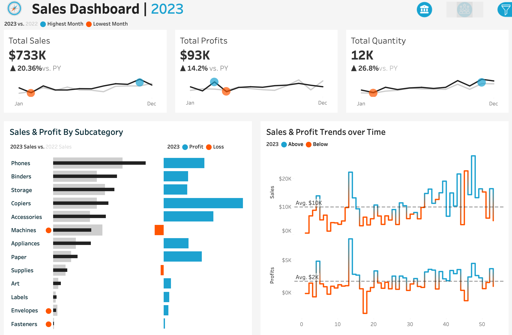

# Project Background

This project delivers a comprehensive Tableau solution designed to empower sales managers and executives with actionable insights into Sales and Profit performance across the US market. It features two interactive dashboards — Sales and Customers — that analyze KPIs and trends.

Insights are provided across the following key areas:

- Metrics & Trends Overview: Year‑over‑year sales performance analysis to identify growth opportunities and seasonal patterns.
- KPI Snapshot: High‑level summary of Sales and Profit indicators.
- Sales Trends: Time‑series analysis highlighting monthly and weekly fluctuations in revenue and profitability.
- Product Sub‑Category Comparison: Side‑by‑side view of profits and sales performance across product sub‑categories.
- Customer Insights Dashboard: Deep dive into customer segments, top accounts, and retention metrics.

> Note: This project was originally created as part of a tutorial by YouTuber Name and has been adapted here for demonstration purposes.

# Data Structure

Data Structure as seen below consists of four tables: Orders, Customers, Location, and Products.

  

# Executive Summary

In 2023, sales followed a distinctive two‑phase pattern: a fluctuating first half and a stabilizing second half. During the first half, sales plunged to their lowest point in February, surged by 248% year‑over‑year in January, and then dropped 35% in May. Profit trends in Q1 were even more volatile. March saw a remarkable 230% year‑over‑year profit increase, only to be followed by a 72% downturn in April. After this roller‑coaster start, profits began a steady climb through the second half of the year, mirroring the smoother sales recovery.

Below is the Tableau dashboard overview. Additional examples and detailed analyses appear throughout the report. You can download the interactive dashboard from the repository for further exploration.

  

#### Sales & Profit Trends

- 
