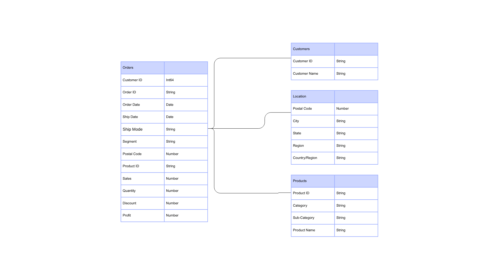

# Project Background

This project delivers a comprehensive Tableau solution designed to empower sales managers and executives with actionable insights into Sales and Profit performance across the US market. It features two interactive dashboards — Sales and Customers — that analyze KPIs and trends.

Insights are provided across the following key areas:

- Metrics & Trends Overview: Year‑over‑year sales performance analysis to identify growth opportunities and seasonal patterns.
- KPI Snapshot: High‑level summary of Sales and Profit indicators.
- Sales Trends: Time‑series analysis highlighting monthly and weekly fluctuations in revenue and profitability.
- Product Sub‑Category Comparison: Side‑by‑side view of profits and sales performance across product sub‑categories.
- Customer Insights Dashboard: Deep dive into customer segments, top accounts, and retention metrics.

> Note: This project was originally created as part of a tutorial by YouTuber Name and has been adapted here for demonstration purposes.

# Data Structure

Data Structure as seen below consists of four tables: Orders, Customers, Location, and Products.

  

